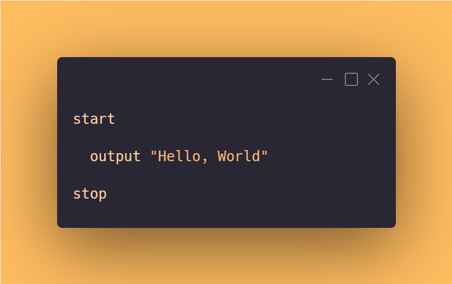
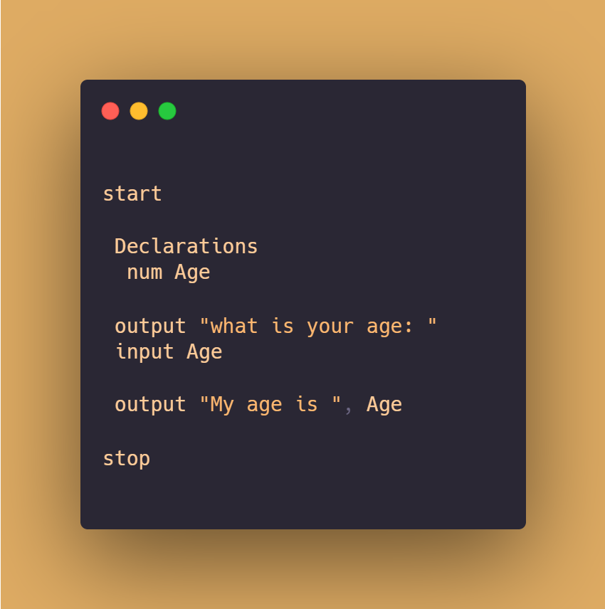

## Getting Started With PseudoBlocks

 


 

<a
style="height:50px;width:120px; font-size:large;border-radius:50px;background:transparent;color:orange; padding:10px;border:1px solid orange;"
href="https://github.com/Daniel-Kenan/pseudoblocks/releases/download/v1.0.4/PseudoBlocksSetUp.exe">Download</a>


pseudo code is case insentive but still requires user to be case sensitive on variables.
This program was designed to help assist students run algorithms written with pseudo code with providing an isolated environment.So they can better understand and grasp programming concepts  with ease.Students will better understand the commandline interface

To learn more about syntax it is highly advised you read [Just Enough Programming Logic and Design 2nd Edition](https://pdfhost.io/v/csFeVPBzn_Just_Enough_Programming_Logic_and_Design_2nd_Edition)

Whenever you commit to this repository, GitHub Pages will run [Jekyll](https://jekyllrb.com/) to rebuild the pages in your site, from the content in your Markdown files.

 

 


```js
Microsoft Windows [Version 10.0.19044.1826]
(c) Microsoft Corporation. All rights reserved.

C:\Users\Daniel> pseudo
```


```cmd
Microsoft Windows [Version 10.0.19044.1826]
(c) Microsoft Corporation. All rights reserved.

C:\Users\Daniel> pseudo

You just called pseudo with no argument

run pseudo with a filename located in the current folder

# FOR EXAMPLE RUN
pseudo example.txt

# FOR HELP RUN
pseudo --help

```


```cmd
Microsoft Windows [Version 10.0.19044.1826]
(c) Microsoft Corporation. All rights reserved.

C:\Users\Daniel> pseudo main.txt 

Hello, World


```

```cmd
Microsoft Windows [Version 10.0.19044.1826]
(c) Microsoft Corporation. All rights reserved.

C:\Users\Daniel> pseudo main.txt --test helloworld

RUNNING TEST CASE: helloworld
A simple hello world program :-)

*************************** Case: 1 **************************


THE EXPECTED SCREEN_OUTPUT SHOULD BE:
Hello, World

PROGRAM GENERATED SCREEN_OUTPUT IS:
Hello, World

✓ passed this case


---------------------------- DONE ----------------------------


From 1 scenario(s), you solved 1


```


For more details see [Basic writing and formatting syntax](https://docs.github.com/en/github/writing-on-github/getting-started-with-writing-and-formatting-on-github/basic-writing-and-formatting-syntax).

### Jekyll Themes

Your Pages site will use the layout and styles from the Jekyll theme you have selected in your [repository settings](https://github.com/Daniel-Kenan/pseudo-blocks/settings/pages). The name of this theme is saved in the Jekyll `_config.yml` configuration file.

### Support or Contact

Having trouble with Pages? Check out our [documentation](https://docs.github.com/categories/github-pages-basics/) or [contact support](https://support.github.com/contact) and we’ll help you sort it out.
