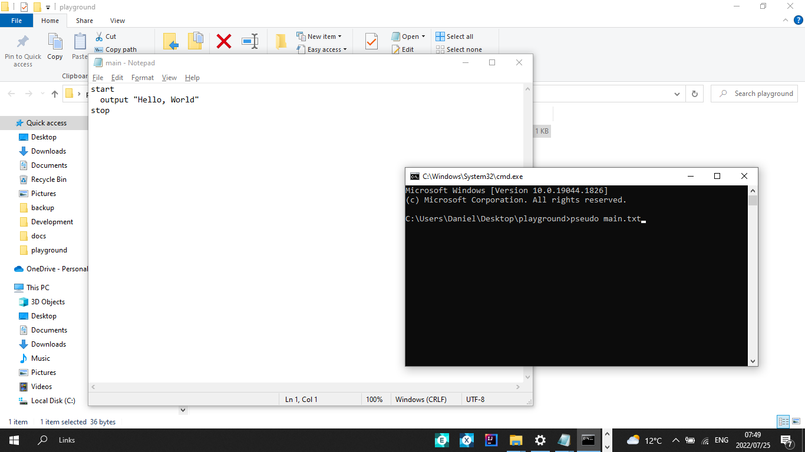

## Getting Started With PseudoBlocks

 


 

<a
style="height:50px;width:120px; font-size:large;border-radius:50px;background:transparent;color:orange; padding:10px;border:1px solid orange;"
href="https://github.com/Daniel-Kenan/pseudoblocks/releases/tag/v1.0.7" download>Download</a>

<br>

#### PseudoBlocks is a interpreter that allows you to learn faster and translate systems more effectively.
<br>

pseudo blocks is case insentive but still requires user to be case sensitive on variables.
This program was designed to help assist students run algorithms written with pseudo code with providing an isolated environment.So they can better understand and grasp programming concepts  with ease.Students will better understand the commandline interface

To learn more about syntax it is Strongly advised you read [Just Enough Programming Logic and Design 2nd Edition](https://pdfhost.io/v/csFeVPBzn_Just_Enough_Programming_Logic_and_Design_2nd_Edition)

## Write Your First  Program

 


You can use any notepad or IDE of your choice. Make sure you have downloaded the setup installer above 


```powershell
Microsoft Windows [Version 10.0.19044.1826]
(c) Microsoft Corporation. All rights reserved.

C:\Users\Daniel\Desktop\playground> pseudo

You just called pseudo with no argument

run pseudo with a filename located in the current folder

# FOR EXAMPLE RUN
pseudo example.txt

# FOR HELP RUN
pseudo --help

```


```pseudo --help``` for more commands


```powershell
Microsoft Windows [Version 10.0.19044.1826]
(c) Microsoft Corporation. All rights reserved.

C:\Users\Daniel\Desktop\playground> pseudo main.txt 

Hello, World


```
#### >> To edit before executing

```powershell
Microsoft Windows [Version 10.0.19044.1826]
(c) Microsoft Corporation. All rights reserved.

C:\Users\Daniel\Desktop\playground> pseudo main.txt --edit

Hello, World


```


#### >> For autocompletion on the command prompt

```powershell
Microsoft Windows [Version 10.0.19044.1826]
(c) Microsoft Corporation. All rights reserved.

C:\Users\Daniel\Desktop\playground> pseudo highlight

```
#### >> run testcases on a file

```powershell
Microsoft Windows [Version 10.0.19044.1826]
(c) Microsoft Corporation. All rights reserved.

C:\Users\Daniel\Desktop\playground> pseudo main.txt --test helloworld

RUNNING TEST CASE: helloworld
A simple hello world program :-)

*************************** Case: 1 **************************


THE EXPECTED SCREEN_OUTPUT SHOULD BE:
Hello, World

PROGRAM GENERATED SCREEN_OUTPUT IS:
Hello, World

✓ passed this case


---------------------------- DONE ----------------------------


From 1 scenario(s), you solved 1


```

<br> 

### Pseu is package manager built-in pseudo blocks to download and mange testcases

#### >> To check locally available testcases

```powershell
C:\Users\Daniel\Desktop\playground> pseu local

 Area
 helloworld
 Square

C:\Users\Daniel\Desktop\playgrounds>

```
#### >> Before checking the available testcases online run

```powershell
C:\Users\Daniel\Desktop\playground> pseu update


C:\Users\Daniel\Desktop\playground>

```

#### >> To check internet available testcases

```powershell
C:\Users\Daniel\Desktop\playground> pseu global

 Area
 helloworld
 Square
 --more--

C:\Users\Daniel\Desktop\playground>

```
#### >> To check locally available testcases

#### >> you can download a testcase by using the download argument

```powershell
C:\Users\Daniel\Desktop\playground> pseu download helloworld

Downloaded helloworld testcase

C:\Users\Daniel\Desktop\playground\Desktop>
```
#### >> To translate pseudocode to java

```powershell
C:\Users\Daniel\Desktop\playground> pseudo translate <filename> java


C:\Users\Daniel\Desktop\playground>

```

#### >> To translate pseudocode to cpp

```powershell
C:\Users\Daniel\Desktop\playground> pseudo translate <filename> cpp


C:\Users\Daniel\Desktop\playground>

```


For more details see [Basic writing and formatting syntax](https://docs.github.com/en/github/writing-on-github/getting-started-with-writing-and-formatting-on-github/basic-writing-and-formatting-syntax).

### Common Issue

If the setup installer failed to load the enviroment variables, you can do it manually to the installation path or run the setupfile as administrator located in the directory as `setup.cmd` configuration file.

### Support or Contact

Having trouble with Pages? Check out our [Discussion Forum](https://github.com/Daniel-Kenan/pseudoblocks/discussions) or [Contact Support](https://github.com/Daniel-Kenan/pseudoblocks/issues) and we’ll help you sort it out.
